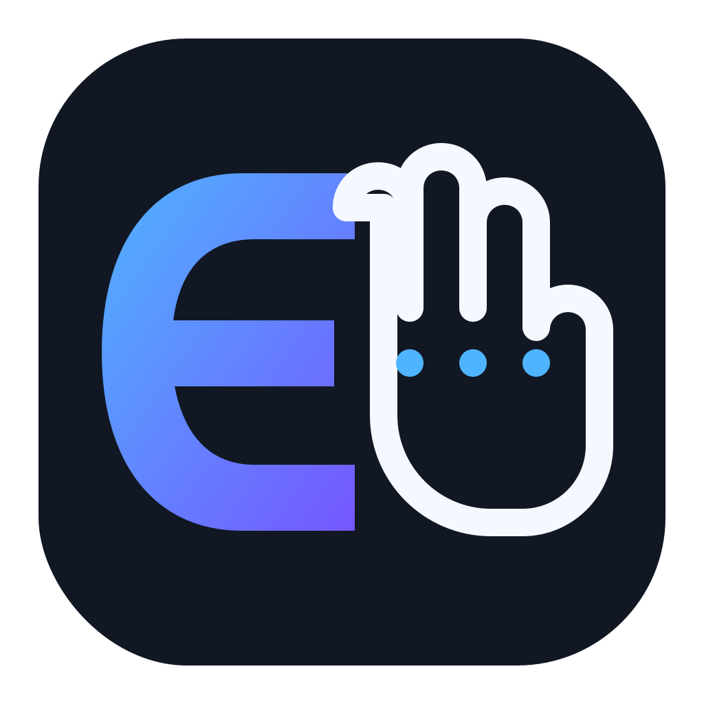
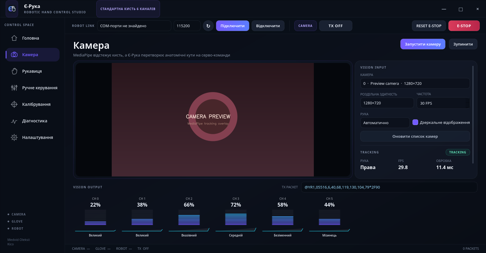

<div align="center">
  
  <h1>Є-Рука</h1>
  <p><strong>Керування роботизованою кистю через камеру, жести, сенсорну рукавицю та ESP32.</strong></p>
  <p>Створено в Україні · By Kico</p>

  [](https://github.com/Oleksii1221/Ye-ruka/releases/latest)
  [](https://github.com/Oleksii1221/Ye-ruka/actions/workflows/ci.yml)
  [](LICENSE)
  [](https://github.com/Oleksii1221/Ye-ruka/releases/latest)
  [](https://github.com/Oleksii1221/Ye-ruka/releases/latest)

  **[Завантажити Windows](https://github.com/Oleksii1221/Ye-ruka/releases/latest)** · **[Завантажити Ubuntu](https://github.com/Oleksii1221/Ye-ruka/releases/latest)** · **[Сайт проєкту](https://oleksii1221.github.io/Ye-ruka/)** · **[Повідомити про проблему](https://github.com/Oleksii1221/Ye-ruka/issues/new/choose)**
</div>



## Можливості

- розпізнавання руки й жестів камерою через MediaPipe;
- ручне керування всіма сімома сервоприводами;
- жести «лайк», «коза», розкриття, стискання та власні пози;
- підключення сенсорної рукавиці через окремий COM-порт;
- вбудоване прошивання ESP32 робочою або сервісною прошивкою;
- сервісний режим для прямого тестування DS3225 від `-90°` до `+90°`;
- українська й англійська мови, системна, темна та світла теми;
- аварійна зупинка, безпечні позиції, фільтрація та обмеження швидкості;
- інсталятор Windows, portable ZIP і Ubuntu x64 `.tar.gz` збірка.

## Встановлення

1. Відкрийте [останній реліз](https://github.com/Oleksii1221/Ye-ruka/releases/latest).
2. Для Windows завантажте `Ye-Ruka-...-Windows-x64-Setup.exe`.
3. Для Ubuntu завантажте `Ye-Ruka-...-Ubuntu-x64.tar.gz`, розпакуйте архів і запустіть `start-ye-ruka.sh`.
4. Підключіть ESP32 через USB і виберіть її COM-порт у застосунку.

Python, Arduino IDE та окремі бібліотеки для готового релізу не потрібні.

## Перший запуск

Перед подачею живлення на механіку перевірте відповідність каналів:

| Канал | Призначення | Розжато | Зжато |
|---:|---|---:|---:|
| 1 | Мізинець | -45° | 90° |
| 2 | Безіменний | 70° | -65° |
| 3 | Середній | -40° | 90° |
| 4 | Вказівний | -50° | 90° |
| 5 | Великий палець, згин | 80° | -30° |
| 6 | Великий палець, наближення | 50° | 90° |
| 7 | Великий палець до долоні | 50° | 50° |

Спочатку використовуйте сторінку **Обслуговування** з від'єднаною механічною тягою або без навантаження. Не тримайте сервопривід у механічному упорі.

## Прошивання ESP32

1. Відкрийте **Обслуговування**.
2. Виберіть COM-порт ESP32.
3. Встановіть **робочу прошивку** для звичайного керування або **сервісну прошивку** для ручної перевірки серв.
4. Під час прошивання не від'єднуйте USB і живлення плати.

Застосунок використовує офіційний `espflash`; готові образи прошивок входять до релізу.

## Розробка

Потрібен Python 3.11 x64.

```powershell
python tools/project.py setup
python tools/project.py run
python tools/project.py check
```

Повна локальна збірка для поточної ОС:

```powershell
python tools/project.py release
```

Усі команди доступні через `python tools/project.py --help`. BAT-файли не використовуються.

## Гілки та релізи

- `master` містить лише перевірені релізні версії;
- `dev` є основною гілкою поточної розробки;
- зміни потрапляють у `master` через pull request після перевірок;
- реліз позначається тегом `vX.Y.Z`, після чого GitHub Actions збирає Windows і Ubuntu артефакти.

Докладніше: [CONTRIBUTING.md](CONTRIBUTING.md) і [GOVERNANCE.md](GOVERNANCE.md).

## Документація

- [Протокол керування](docs/HAND_CONTROLLER_PROTOCOL_UK.md)
- [Serial-протокол](docs/SERIAL_PROTOCOL_UK.md)
- [Сенсорна рукавиця](docs/GLOVE_PROTOCOL_UK.md)
- [Калібрування](docs/CALIBRATION_UK.md)
- [Вирішення проблем](docs/TROUBLESHOOTING_UK.md)
- [Архітектура](ARCHITECTURE.md)

## Правові документи

Код проєкту поширюється за ліцензією [MIT](LICENSE). Політика приватності описана в [PRIVACY.md](PRIVACY.md), правила безпеки в [SECURITY.md](SECURITY.md), а ліцензії залежностей у [THIRD_PARTY_LICENSES.md](THIRD_PARTY_LICENSES.md).

Copyright © 2026 Medvid Oleksii (Kico).
